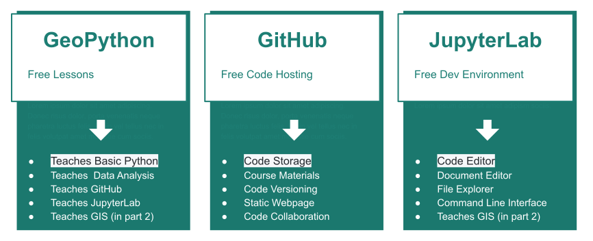

# What is this Guide?
This guide is designed to help you prepare for, and complete, the free GeoPython course from Helsinki University. The GeoPython course teaches basic Python, Python libraries, and data analysis techiques (GIS is taught in the second course Automating GIS).  There are 7 lessons that progressively take you through all the steps needed to collect weather data from NOAA and display it in a graph.  The lessons range from taking a few hours to complete, to potentially taking a few days.

The GeoPython tutorial:  
**GeoPython**  website is the course book,  
**JupyterLab** is the code development environment,  
**GitHub** hosts your code and the course materials.

 

All of this will be explained in the course and additional resources will be listed. 

[  GEO-PYTHON Course  ](https://geo-python-site.readthedocs.io/en/latest/)  |  [  More info about the course  ](read_more.md) | [  Resources  ](learn_more.md) 

